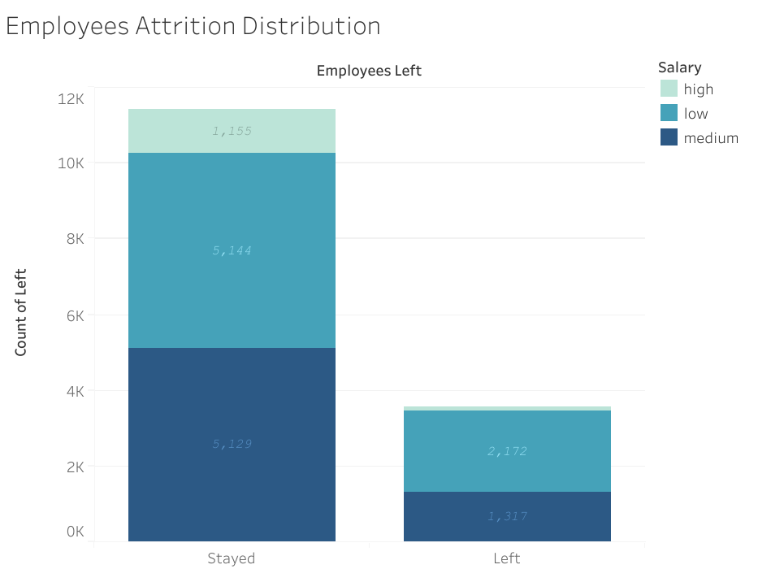

# HR Analytics Employee Attrition Prediction

## Overview
The purpose/objective of the project is to analyze the employee data and build predictive models that can provide insights to the Human Resources (HR) department of a large consulting firm. The project uses the survyed data based on satisfaction and such factors. The project grows upon building multiple model leading to crown best performing model the champion, which is Random Forest model with an accuracy 95% and precision of 89%.

## Business understanding
In accordance with US Bureau of Labor Statistics the average working hours for an employee, a week can vary from 34.4 hours to 38.7 hours. Thus, if performed a well calculated estimation the average working hours for an employee, with a grant of atleast two week vacation, is 158.37 hours per month. But the employees are working more than average hours with low salary, so it's important to be familiar with the factors such as saticfaction level, and more for employee attrition.

## Data Understanding
The data is sourced form survey conducted by the organisation, and contains about 10 unique features with 14999 employee information innately. The dataset contains features such as satisfaction level, evaluation scores, projects, average monthly working hours per employee, tenure, promotion, department and salary.

The chart below shows number od employees left/stayed with the their respective salary. 

## Modeling & Evaluation
A random forest model comprising 400 decision trees was used to determine feature importance in who would tip generously or not. The overall model performed with 95% accuracy and 89% precision. 

## Conclusion
The model can be extemely valuable to understand if the employee is overworked causing him/her to leave the company. In the future, adding more information on a employee’s past behavior may also be beneficial in helping the stakeholder address their business problem. 
